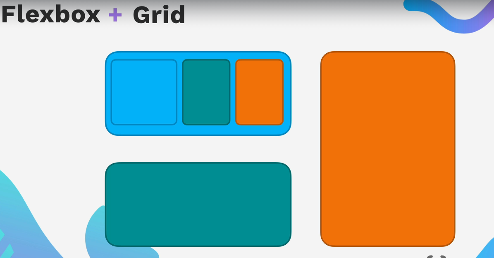

# Grid

> Flexbox


> Grid


Now here Flexbox work on 1-Dimensional and Grid works on 2-Dimensional as shown above pic.



Link of Grid vs Flexbox website in github

- [https://appbrewery.github.io/grid-vs-flexbox/](https://appbrewery.github.io/grid-vs-flexbox/)

Playaround with this.

## How to use Grid

```html
<div class="container">
  <p>...</p>
  <p>...</p>
  <p>...</p>
</div>
```

```css
.container {
  display: grid;
  grid-template-columns: 1fr 2fr;
  grid-template-rows: 1fr 2fr;
  gap: 10px;
}
```
