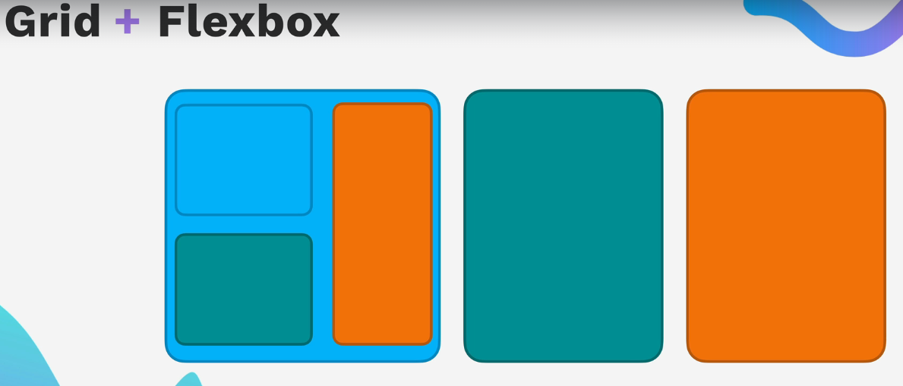
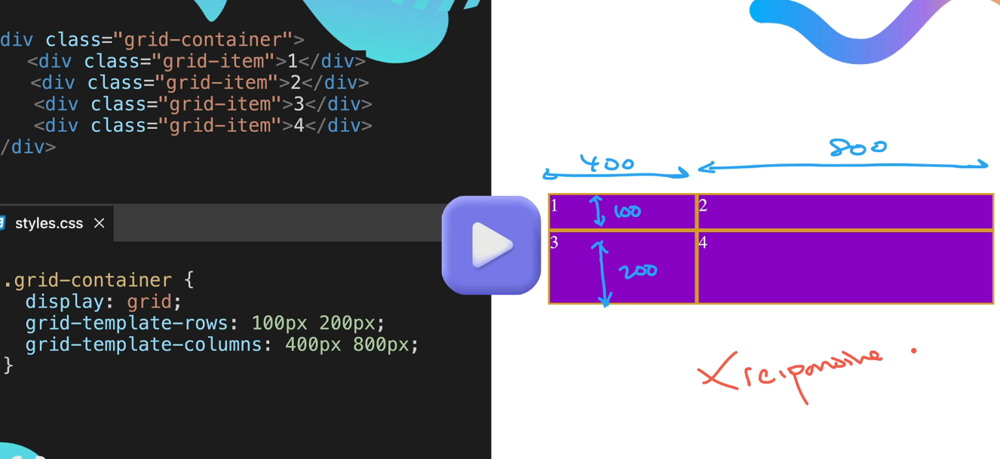
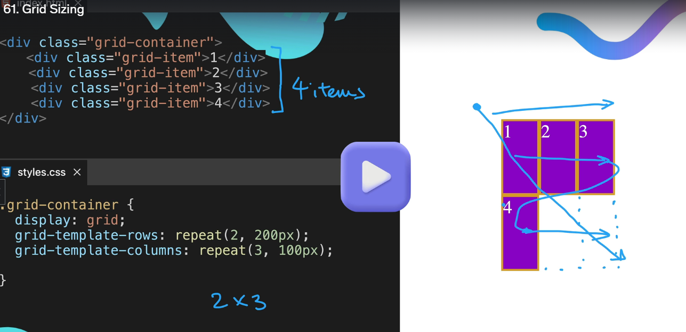
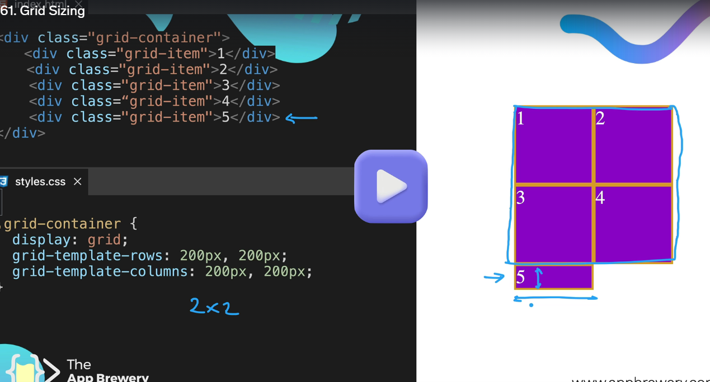
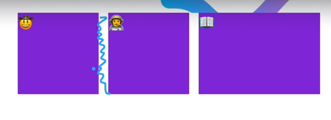
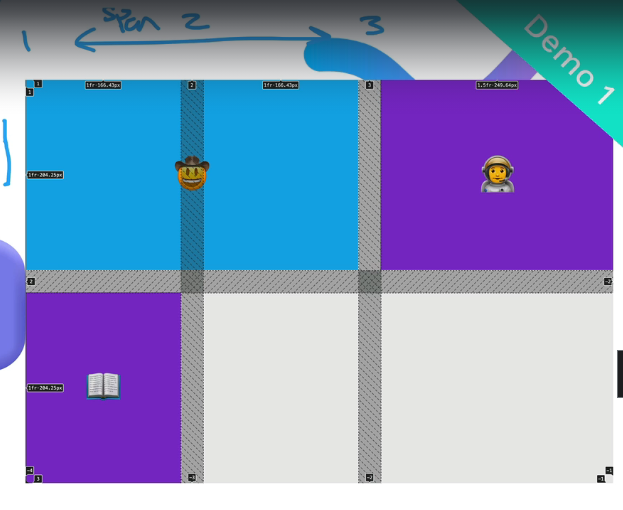
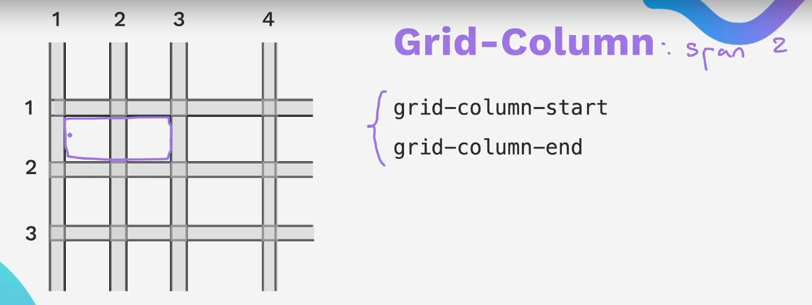
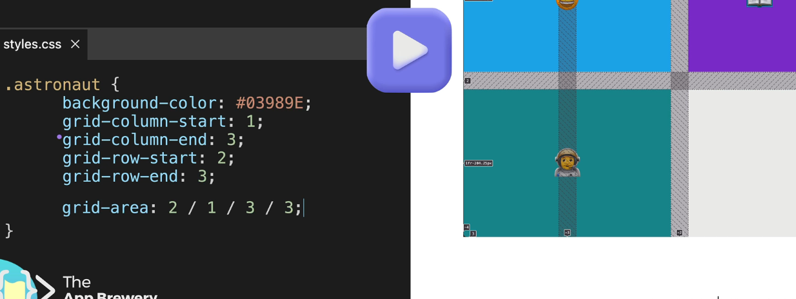
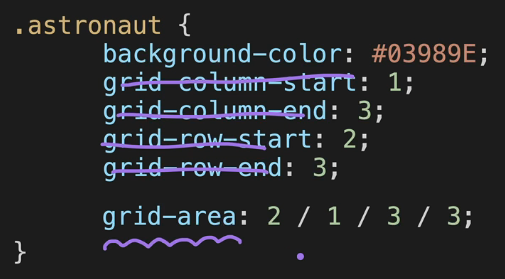
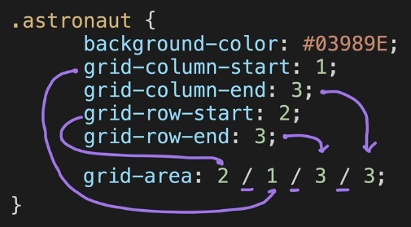

# Grid

## 1 Display Grid

> Flexbox


> Grid


Now here Flexbox work on 1-Dimensional and Grid works on 2-Dimensional as shown above pic.

> Flexbox vs Grid


> Grid vs Flexbox



Link of Grid vs Flexbox website in github

- [https://appbrewery.github.io/grid-vs-flexbox/](https://appbrewery.github.io/grid-vs-flexbox/)

Playaround with this.

## How to use Grid

```html
<div class="container">
  <p>...</p>
  <p>...</p>
  <p>...</p>
</div>
```

```css
.container {
  display: grid; /* in Flexbox - display: flex; */
  grid-template-columns: 1fr 2fr;
  grid-template-rows: 1fr 2fr;
  gap: 10px;
}
```


`1fr` means **fraction**

## Exercise

```html
<!DOCTYPE html>
<html>
  <head>
    <title>Chessboard</title>
    <style>
      /* Write your code here */
      /* Each square should be 100px by 100px */
      /* My colours for white: #f0d9b5, black: #b58863 */
    </style>
  </head>

  <body>
    <div class="container">
      <div class="white"></div>
      <div class="black"></div>
      <div class="white"></div>
      <div class="black"></div>
      <div class="white"></div>
      <div class="black"></div>
      <div class="white"></div>
      <div class="black"></div>
      <div class="black"></div>
      <div class="white"></div>
      <div class="black"></div>
      <div class="white"></div>
      <div class="black"></div>
      <div class="white"></div>
      <div class="black"></div>
      <div class="white"></div>
      <div class="white"></div>
      <div class="black"></div>
      <div class="white"></div>
      <div class="black"></div>
      <div class="white"></div>
      <div class="black"></div>
      <div class="white"></div>
      <div class="black"></div>
      <div class="black"></div>
      <div class="white"></div>
      <div class="black"></div>
      <div class="white"></div>
      <div class="black"></div>
      <div class="white"></div>
      <div class="black"></div>
      <div class="white"></div>
      <div class="white"></div>
      <div class="black"></div>
      <div class="white"></div>
      <div class="black"></div>
      <div class="white"></div>
      <div class="black"></div>
      <div class="white"></div>
      <div class="black"></div>
      <div class="black"></div>
      <div class="white"></div>
      <div class="black"></div>
      <div class="white"></div>
      <div class="black"></div>
      <div class="white"></div>
      <div class="black"></div>
      <div class="white"></div>
      <div class="white"></div>
      <div class="black"></div>
      <div class="white"></div>
      <div class="black"></div>
      <div class="white"></div>
      <div class="black"></div>
      <div class="white"></div>
      <div class="black"></div>
      <div class="black"></div>
      <div class="white"></div>
      <div class="black"></div>
      <div class="white"></div>
      <div class="black"></div>
      <div class="white"></div>
      <div class="black"></div>
      <div class="white"></div>
    </div>
  </body>
</html>
```

SOLUTION -

Add style code inside above html to work

```html
<style>
  .container {
    display: grid;
    grid-template-columns: 1fr 1fr 1fr 1fr 1fr 1fr 1fr 1fr;
    grid-template-rows: 1fr 1fr 1fr 1fr 1fr 1fr 1fr 1fr;
    /* gap: 0px;  NOT working */
    width: 800px;
  }
  .white {
    background-color: #f0d9b5;
    height: 100px;
    width: 100px;
  }
  .black {
    background-color: #b58863;
    height: 100px;
    width: 100px;
  }
</style>
```

## 2 Grid sizing



### You can write alternative as shown below

```css
/*        NOT RESPONSIVE */
.container {
  display: grid;
  grid-template: 100px 200px / 400px 800px; /*rows / columns  */
}
```

```css
.container {
  display: grid;
  grid-template-rows: 100px auto;
  grid-template-columns: 200px auto;
}
```

Link for the Grid sizing website in github

- [https://appbrewery.github.io/grid-sizing/](https://appbrewery.github.io/grid-sizing/)

> > [**_columns : Horizontal_**] - / - [**_rows : Vertical_**]. In fractions _Horizontal_ can stretch upto width of the browser but where as the row(_vertical_) stretch upto the content inside of grid

### minmax(min-value,max-value)

```html
<div class="grid-container">
  <div class="grid-item">1</div>
  <div class="grid-item">2</div>
  <div class="grid-item">3</div>
  <div class="grid-item">4</div>
</div>

<style>
  .container {
    display: grid;
    grid-template-rows: 200px 400px;
    grid-template-columns: 200px minmax(400px, 800px); /*min-value:400px , max-value:800px  */
  }
</style>
```

### repeat(repeat-value, size-value)

```html
<div class="grid-container">
  <div class="grid-item">1</div>
  <div class="grid-item">2</div>
  <div class="grid-item">3</div>
  <div class="grid-item">4</div>
</div>

<style>
  .container {
    display: grid;
    grid-template-rows: repeat(2, 200px);
    grid-template-columns: repeat(2, 400px);
  }
</style>
```



### auto sizing even not mentioned in css for extra div based on there size of content



### auto sizing even not mentioned in css for extra div, _grid-auto-rows_

```html
<div class="grid-container">
  <div class="grid-item">1</div>
  <div class="grid-item">2</div>
  <div class="grid-item">3</div>
  <div class="grid-item">4</div>
  <div class="grid-item">5</div>
</div>

<style>
  .container {
    display: grid;
    grid-template-rows: 200px 200px;
    grid-template-columns: 200px 200px;
    grid-auto-rows: 300px;
  }
</style>
```

### exercise

- [https://appbrewery.github.io/grid-sizing/test.html](https://appbrewery.github.io/grid-sizing/test.html)

- SOLUTION

```CSS
.grid-container {
  display: grid;
  grid-template-columns: auto 400px minmax(200px,500px);
  grid-template-rows: 1fr 1fr 2fr;
  grid-auto-rows: 50px;
}
```

## Grid Item Placement

How to layout items in the grid

Grid Common terms

- Lines
- Tracks
- Cells
- Container
- Items
- Gap
- Row
- Column

  




### Exercise

```html
<!DOCTYPE html>
<html lang="en">
  <head>
    <meta charset="UTF-8" />
    <meta name="viewport" content="width=device-width, initial-scale=1.0" />
    <title>Grid Placement</title>
    <style>
      body {
        padding: 0;
        margin: 0;
      }

      .container {
        height: 100vh;
        display: grid;
        gap: 3rem;
        grid-template-columns: 1fr 1fr 1.5fr;
        grid-template-rows: 1fr 1fr;
      }

      .item {
        font-size: 5rem;
        color: white;
        font-family: Arial, Helvetica, sans-serif;
        background-color: blueviolet;
        /* TODO: Use Flexbox to align the text to the center horizontally and vertically. 
      See goal1 image.
      */
      }
    </style>
  </head>

  <body>
    <div class="container">
      <div class="item cowboy">🤠</div>
      <div class="item astronaut">👨‍🚀</div>
      <div class="item book">📖</div>
    </div>
  </body>
</html>
```

```css
/*                SOLUTION */
.item {
  display: flex;
  justify-content: center;
  align-items: center;
}
```

### Span Demo 1

Suppose we want to increase cowboy grid then we can use,

```html
<html>
  <head>
    <style>
      .cowboy {
        background-color: #00b9ff;
        grid-column: span 2;
      }
    </style>
  </head>
  <body>
    <div class="container">
      <div class="item cowboy">🤠</div>
      <div class="item astronaut">👨‍🚀</div>
      <div class="item book">📖</div>
    </div>
  </body>
</html>
```



we can see the Tracks in Chrome Developer Tools CDT

Open **_CDT_** -> click on `grid` element tag -> click on `layout` tab -> In **Overlay Display Settings** -> select checkbox `show track sizes`

### Grid Column & Row

If you see Demo1.html [Click here](./assets/grid/10.2%20Grid%20Placement/demo1.html) code and in style section click this arrow &rarr; of `grid-column`

```css
.cowboy {
  grid-column: span 2;
  /* 
  grid-column-start: auto 2;
  grid-column-end: auto;
  */
}
```


As you see we can use `grid-row-start` instead of `column` for row span.


See Demo2.html for Order in Grid  
we can use `order: <numberValue>`

```css
.astronaut {
  order: 1;
}
```

### Grid Exercise 2 

see Exercise2.html [Click here](./assets/grid/10.2%20Grid%20Placement/exercise2.html) code

### Grid Rows (pending)





[Flexbox Froggy - flexbox](https://flexboxfroggy.com/)
[Grid garden - Grid](https://appbrewery.github.io/gridgarden/)


### Grid Project - Mondrian Project

Author - Piet Mondrian

**Question**

```html
<!DOCTYPE html>
<html lang="en">

<head>
  <meta charset="UTF-8">
  <meta name="viewport" content="width=device-width, initial-scale=1.0">
  <title>Mondrian Project</title>
  <style>
    /* 
    Write your CSS here 
    Gap Colour: #000
    White: #F0F1EC
    Red: #E72F24
    Black: #232629
    Blue: #004592
    Yellow: #F9D01E

    For dimensions, see dimensions.png image.
    HINT: Remember you can't change the properties of grid lines.
    But grid lines are transparent!
    */
  </style>
</head>

<body>
  <!-- Write your HTML here -->
</body>

</html>
```

**SOLUTION**

```html
<!DOCTYPE html>
<html lang="en">

<head>
  <meta charset="UTF-8">
  <meta name="viewport" content="width=device-width, initial-scale=1.0">
  <title>Mondrian Project</title>
  <style>
    /* 
    Write your CSS here 
    Line Colour: #000
    White: #F0F1EC
    Red: #E72F24
    Black: #232629
    Blue: #004592
    Yellow: #F9D01E
    */
    body {
      display: flex;
      justify-content: center;
      align-items: center;
      height: 100vh;
      margin: 0;
      padding: 0;
    }

    .container {
      height: 748px;
      width: 748px;
      display: grid;
      background-color: #000;
      grid-template-columns: 320px 198px 153px 50px;
      grid-template-rows: 414px 130px 155px 22px;
      gap: 9px;
    }

    .item {
      background-color: #F0F1EC;
    }

    .red {
      background-color: #E72F24;
    }

    .white1 {
      grid-column: span 3;
    }

    .white2 {
      grid-row: span 2;
    }

    .white3 {
      grid-area: 2 / 2 / 4 /4
    }

    .blue {
      background-color: #004592;
      border-bottom: 10px solid #000;
    }

    .white4 {
      grid-row: span 2;
    }

    .yellow {
      background-color: #F9D01E;
    }

    .black {
      background-color: #232629;
    }
  </style>
</head>

<body>
  <!-- Write your HTML here -->

  <div class="container">
    <div class="item red"></div>
    <div class="item white1"></div>
    <div class="item white2"></div>
    <div class="item white3"></div>

    <div class="item blue"></div>
    <div class="item white4"></div>

    <div class="item"></div>
    <div class="item yellow"></div>
    <div class="item black"></div>
  </div>
</body>

</html>
```