# Basics of Web bootcamp

## CSS -

### Level 1

- class selectors
- Id selectors
- Element selectors
- Attribute selectors

- background-color
- color
- height
- width

### Level 2

Font Properties

- font-weight
- font-size
- font-family
- text-align

> 1 px ---> 1/96^th^ inch ----> 0.26 mm  
> 1 pt ---> 1/72^th^ inch ----> 0.35 mm  
> 1 em ---> 100% of parent tag  
> 1 rem ---> 100% of root (root means <html> tag)

```html
<body>
  <!-- 20px   -->
  <h1>Hello</h1>
  <!--  1em = 20px  or 2em = 40px  -->
</body>
```

```html
<html>
  <!--  20px  -->
  <body>
    <footer>
      <h2>Hello</h2>
      <!--  1rem  = 20px  or 2rem = 40px  -->
    </footer>
  </body>
</html>
```

### Level 3

- [Margin](#margin)
- [Padding](#padding)
- [Border](#border)
- [pesticide](#pesticide-extension)(chrome extension)


#### Margin

```css
 {
  margin: 0px 10px 20px 30px;

  /* TOP RIGHT BOTTOM LEFT (clock-wise) */

  margin: 10px 20px;
  /* top&bottom   right&left */
}
```

#### Padding

```css
 {
  padding: 0px 10px 20px 30px;

  /* TOP RIGHT BOTTOM LEFT (clock-wise) */

  padding: 10px 20px;
  /* top&bottom   right&left */
}
```

#### Border

```css
p1 {
  border: 30px solid black;
}

 {
  border-width: 0px 10px 20px 30px;

  /* TOP RIGHT BOTTOM LEFT (clock-wise) */

  border-width: 10px 20px;
  /* top&bottom   right&left */
}
```

#### Pesticide extension

After installing extension and open a website which is live website(running on a server) then press `ctrl` to see the hover bar at the bottom.

### CSS Cascade

cascade means (you can search in google)
but here we should know the importance of multiple rules applied on same element or tag, which rule is applied first.
First bowser see the **External CSS** then **Internal CSS** then **Inline CSS**

> External CSS ----> Internal CSS ----> Inline CSS

#### Important of CSS catogory precedence rule

1. Position
2. Specifity
3. Type
4. Importance

##### 1. Position

```css
li {
  color: red;
  color: blue;
}
```

##### 2. Specifity

> **NOTE:** flows goes from TOP to BOTTOM. Element Selector --> Class Selector ---> Attribute Selector ---> Id Selector

```html
<li id="first-class" class="first-class" draggable></li>
```

```css
li {
  /* this one is least specific. Element Selector*/
  color: blue;
}
.first-class {
  color: red;
}
li[draggable] {
  color: purple;
}
#first-class {
  color: orange;
}
```

##### 3. Type

```html
<link rel="stylesheet" href="./style.css" />
<style></style>
<h1 style=" ">Hello</h1>
```

##### 4. Importance

```css
color: red;
color: green !important;
```

#### Combining CSS

```html
<p>Yellow text</p>
<div class="box inner-box">
  <p>White Text</p>
</div>
```

```css
p {
  color: Yellor;
}
.inner-box p {
  color: white;
}
```

##### 1. Group rule

Group = Apply to both selectors

```css
selector,
selector {
  color: bluevoilet;
}
```

##### 2. Child rule

It's only work only ONE child element tag, NOT for grand child.
Works on Only One level deep.

```css
selector > selector {
  color: firebrick;
}
```

selector `>` selector means parent `>` child

##### 3. Descendant

Descendant = Apply to descendant of a left side

```css
selector1 selector2 {
  color: blue;
}
```

selector1 is An Ancestor selector and selector2 is Descendant selector

- Example

```html
<div class="box">
  <p class="done">Do these things today!</p>
  <ul class="list">
    <li>Wash Clothes</li>
    <li class="done">Read</li>
    <li class="done">Maths Questions</li>
  </ul>
</div>
```

```css
.box li {
  color: blue;
}
```

##### 4. Chaining

Chaining = Apply where ALL selectors are true

```css
selector1selector2 {
  color: seagreen;
}
```


##### 5. Combining Combiners

```css
selector1 selector2selector3 {
  font-size: 0.5rem;
}
```

- example - change the font-size of `p` element

```html
<div class="box">
  <p class="done">Do these things today!</p>
  <ul class="list">
    <li>Wash Clothes</li>
    <li class="done">Read</li>
    <li class="done">Maths Questions</li>
  </ul>
</div>

<ul>
  <p class="done">Other items</p>
</ul>
```

```css
.box p.done {
  /* WRONG*/
  font-size: 0.5rem;
}

ul p.done {
  /*CORRECT*/
  font-size: 0.5rem;
}
```

#### CSS Positioning

1. [Static](#1.-static)
2. [Relative](2.-relative)
3. [Absolute](3.-absolute)
4. [Fixed]()

You can practice in this [LINK](https://appbrewery.github.io/css-positioning/)


##### 1. Static


##### 2. Relative


##### 3. Absolute


> NOTE: If `position: relative` is NOT found in Ancestors element then this descendant element will move to TOP-LEFT corner.

- z-index is change order of position in css in z-axis

```css
z-index: 0; /*default value*/
z-index: -1; /*change the order from Top to Bottom*/
```

##### 4. Fixed


## CSS Flag

> create a flag of laos


```html
!DOCTYPE html>
<html lang="en">
  <head>
    <meta charset="UTF-8" />
    <title>CSS Flag Project</title>
    <style>
      .flag {
        width: 900px;
        height: 600px;
        position: relative;
        background-color: #ce1126;
      }

      .flag > div {
        background-color: #002868;
        height: 300px;
        width: 100%;
        position: absolute;
        top: 150px;
      }

      .flag > div > div {
        background-color: white;
        position: absolute;

        height: 200px;
        width: 200px;
        border-radius: 50%;
        top: 50px;
        left: 350px;
      }

      p {
        font-size: 5rem;
        color: white;
        text-align: center;
        padding: 0;
        margin: 0;
      }

      .flag > div div p {
        color: black;
      }
    </style>
  </head>

  <body>
    <div class="flag">
      <p>The Flag</p>
      <div>
        <div>
          <p>of Laos</p>
        </div>
      </div>
    </div>
  </body>
</html>
```

# Advanced CSS

## CSS Display Property

1. Block
2. Inline-Block
3. Inline
4. Span


```html
<!DOCTYPE html>
<html>
  <head>
    <title>CSS Display Property Example</title>
    <style>
      p {
        color: white;
      }

      .red {
        display: block;
        width: 200px;
        height: 200px;
        background-color: red;
      }

      .green {
        display: inline;
        width: 200px;
        height: 200px;
        background-color: green;
      }

      .blue {
        display: inline-block;
        width: 200px;
        height: 200px;
        background-color: blue;
      }
    </style>
  </head>

  <body>
    <h1>CSS Display Property</h1>
    <p class="red">Red Paragraph</p>
    <p class="green">Green Paragraph</p>
    <p class="blue">Blue Paragraph</p>
  </body>
</html>
```

> NOTE: you CANNOT set Height and Width to Inline property.

You can checkout this [LINK](https://appbrewery.github.io/css-display/)

## CSS Float

Wrapping text using float and clear

  
  
  
  
  


### CSS Display

1. Media Queries
2. CSS Grid
3. CSS Flexbox
4. External Frameworks

#### Media Queries

```css
@media (max-width: 600px) {
  /* CSS  for screens below or equal to 
    600px  */
}
```

#### CSS Grid


#### CSS Flexbox


#### Bootstrap framework


> Bootstrap is built on Flexbox

## Media query

```css
@media (max-width: 600px) {
  h1 {
    font-size: 15px;
  }
}
```


```css
@media (mix-width: 600px) and (max-width: 900px) {
  /* Styles for screen between 600 and 900px */
}
```


> Code practice

```css
@media (min-width: 1601px) {
  body {
    background-color: seagreen;
  }
}
@media (min-width: 1201px) and (max-width: 1600px) {
  body {
    background-color: limegreen;
  }
}
@media (min-width: 481px) and (max-width: 1200px) {
  body {
    background-color: powderblue;
  }
}
@media (min-width: 319px) and (max-width: 480px) {
  body {
    background-color: lightsalmon;
  }
}
```

## Flexbox

we have tables to show data in row and column but it is specifically tabular data.

```html
<table>
  <tr class="row">
    <td class="col1">Lorem ipsum dolor sit amet consectetur</td>
    <td class="col2">Lorem ipsum dolor</td>
    <td class="col3">
      Lorem ipsum dolor sit amet consecteturit amet consectetur
    </td>
  </tr>
</table>
```

```css
.col1 {
  width: 25%;
}
.col2 {
  width: 25%;
}
.col3 {
  width: 40%;
}
```


> And as you'll see, there are much, much better tools to do this nowadays.

> So you're not left in the dark.

> After people stopped using tables for layout, they started using what we've explored previously, which is using the display property.


> But this also a lengthy and pain full process to fix this


> This is not a responsive modern website tool. we have **Flexbox**


#### How to USE Flex

Just write `div` with `container` **class**  
and write css `display: flex;` in container

```html
<div class="container">
  <div class="one"><p>...</p></div>
  <div class="two"><p>...</p></div>
  <div class="three"><p>...</p></div>
</div>
```

```css
.container {
  display: flex;
  gap: 10px;
}
```


> There are two different version of flexbox to use as per your requirements

### Assignment

```html
<!DOCTYPE html>
<html lang="en">

<head>
  <meta charset="UTF-8">
  <meta name="viewport" content="width=device-width, initial-scale=1.0">
  <title>Column Layout Methods</title>
  <style>
    p {
      padding: 0;
      margin: 0;
      font-weight: 700;
    }

    li {
      list-style: none;
    }

    .container {
      display: flex;
      gap: 1rem;
      padding: 10px;
      background-color: gold;
    }

  </style>
</head>

<body>
  <div class="container">
    <p>Page Layout Methods</p>

    <li><a href="./html-table.html">HTML Table</a></li>
    <li><a href="./inline-block.html">Inline-Block</li>
    <li><a href="./absolute-position.html">Absolute Positioning</li>
    <li><a href="./float.html">Float</li>
    <li><a href="./flex.html">Flexbox</li>

  </div>
</body>

</html>
```

## Flex Direction

Default flow-direction is `row`

Here we have Two axis

1. main-axis
2. cross-axis

If `flow-direction` is `row` then the Horizontal line is _main-axis_ and vertical line is _cross-axis_

If `flow-direction` is `column` then Horizontal line is _cross-axis_ and vertical line is _main-axis_

These axis are important for length and height configuration in css

##### Assignment Video


## Flex Layout

1. Align
2. Justify
3. Wrap

Order --> `order: 0;` every flex box child item default order value is `0` i.e, `zero`. To change the order of the item you need to assign a order.


> Suppose if we want to move `green` at last position then we can do this

```css
.green {
  order: 1;
}
```

> NOTE: Higher number will be right side

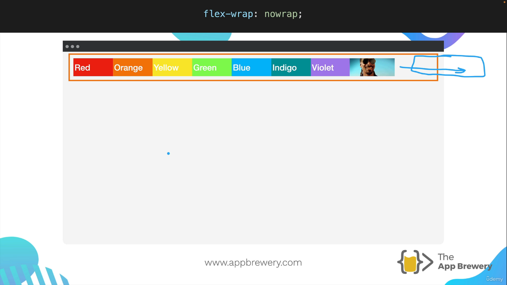

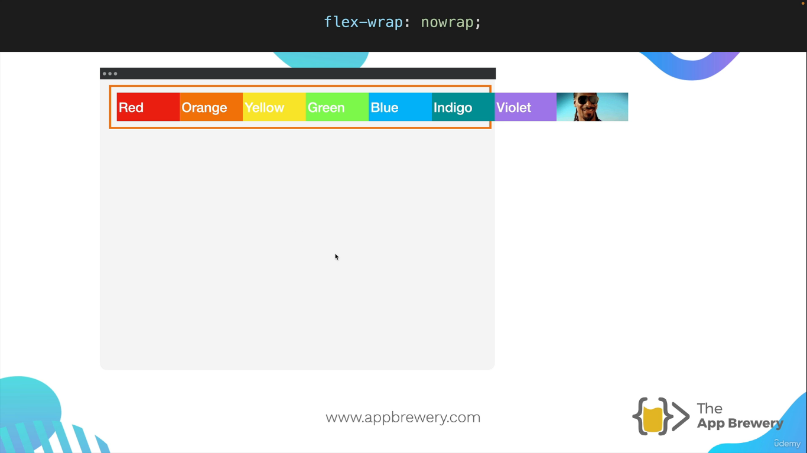

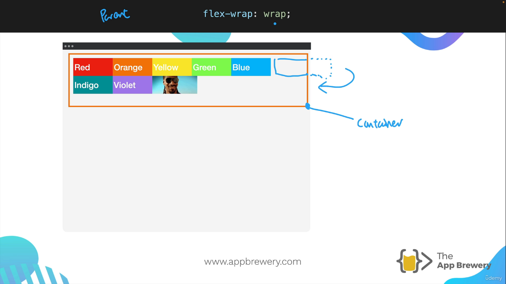

### 1 Wrap

This wrap is Set on parent container.

We have `three` values in flex-wrap in css property.

```css
.container {
  flex-wrap: nowrap;
  /* flex-wrap: wrap; */
  /* flex-wrap: wrap-reverse */
}
```

> https://appbrewery.github.io/flex-layout/

### 2 Justify content

This is also Set on parent container.

```css
.container {
  justify-content: start;
  /* 
  justify-content: end;
  justify-content: center;
  justify-content: space-between;
  justify-content: space-around;

  */
}
```

`space-between` stuck to edges of the container.

`space-around` makes sure that this gap between the left and the right. The center add up to the space between each of the items

`space-evenly` where each of the gaps are equal.

### 3 Align Items

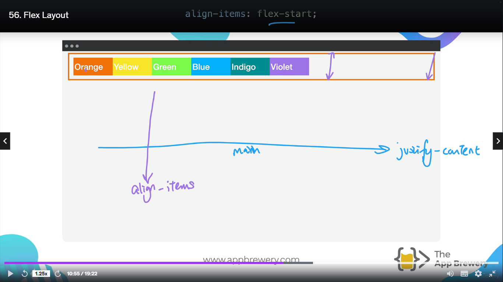

NOTE: To work `align-items` on flex in container, you should maintain height. Because, `justify-content` work on **_main-axis_**(horizontal-axis) and `align-items` work on **_cross-axis_**(vertical-axis).

```css
.container {
  align-items: flex-start;
  height: 70vh; /* vh => viewport height means Display monitor height of the user   */
}
```

TRICKS - [https://css-tricks.com/snippets/css/a-guide-to-flexbox/](https://css-tricks.com/snippets/css/a-guide-to-flexbox/)

### 4 Align contents

```css
.container {
  align-content: flex-start;
  height: 70vh;
}
```

NOTE: Here `align-content` works only on `flex-wrap: wrap`. If you use `nowrap`, it'll not work.

##### Assignment

Froggy GAME [https://appbrewery.github.io/flexboxfroggy/](https://appbrewery.github.io/flexboxfroggy/)

Complete this game task in Intermediate Level

## Flex sizing

1. Shrinking
2. Growing

Priority List

> Content width < Width < flex-basis < min-width/max-width

Here first of all, browser will see the `min-width/max-width` property, if not assigned then goes to `flex-basis` and so on.

Suppose here an example

```css
.container {
  display: flex;
  gap: 10px;
}
.flex-container {
  flex-basis: 100px;
  flex-grow: 0;
  flex-shrink: 0;
}
```

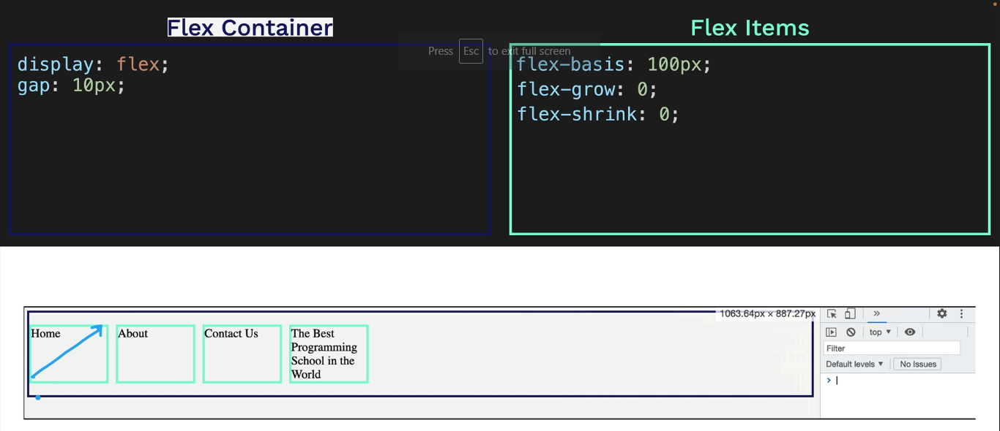
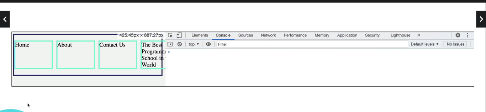

Here you can see above images, it does not at all reacting when browser is shrinking. Width is not changing of any boxes, it same as before.

#### Grow

To react on the browser shinking and growing, here is the code below,

```css
.container {
  display: flex;
  gap: 10px;
}
.flex-container {
  flex-basis: 100px;
  flex-grow: 1;
  flex-shrink: 0;
}
```

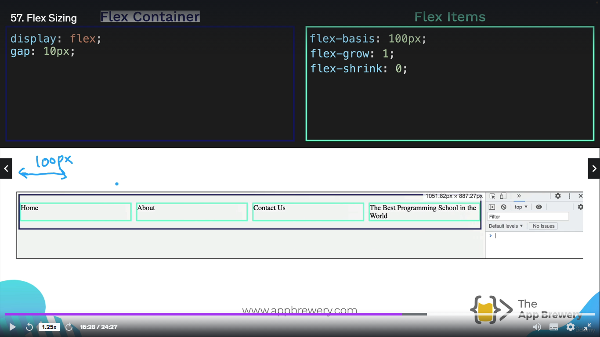
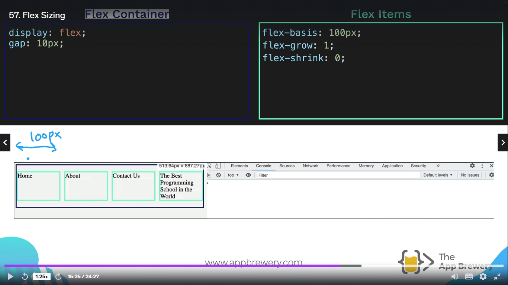

#### Shrink

```css
.container {
  display: flex;
  gap: 10px;
}
.flex-container {
  flex-basis: 100px;
  flex-grow: 0;
  flex-shrink: 1;
}
```

Here what happen is the width is 100px of `flex-basis` value, but if you shrink the page, it shrinks the box upto the `min-width` but here we did not provide `min-width` of flex-items. So it takes `content` width of the flex-box.

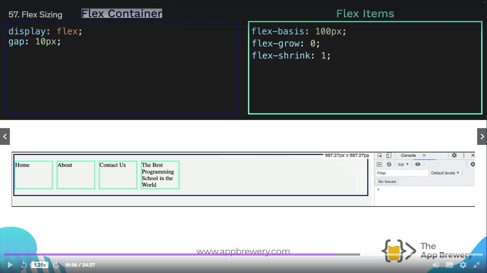
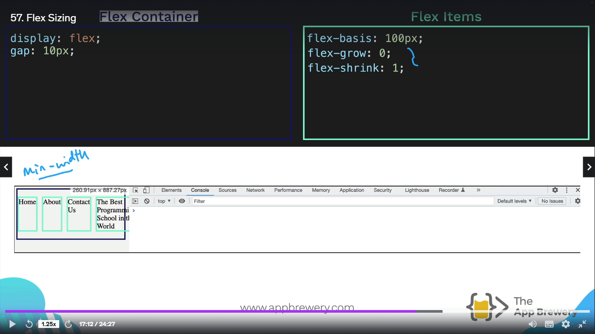

#### Both Shrink and Grow

If both are applied, then `flex-basis` is ignored.

```css
.container {
  display: flex;
  gap: 10px;
}
.flex-container {
  flex-basis: 100px;
  flex-grow: 1; /* max-width  */
  flex-shrink: 1; /* min-width  */
}
```

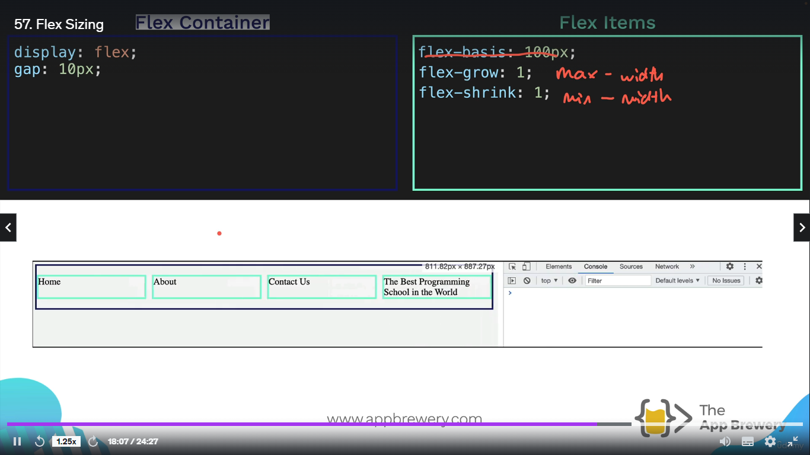


---


Here another trick to use `flex`

```css
.container {
  display: flex;
  gap: 10px;
}
.flex-container {
  /* flex-basis: 0px;
  flex-grow: 1;
  flex-shrink: 1;  */

  flex: 1 1 0; /* grow shrink basis  */
  /* flex: 1;   it means  same as above values   1 1 0   */
}
```


#### Exercise

> [https://appbrewery.github.io/flexbox-sizing-exercise/](https://appbrewery.github.io/flexbox-sizing-exercise/) 


---

#### Project

```html
<!DOCTYPE html>
<html>

<head>
  <title>Flexbox Pricing Table</title>
  <link rel="preconnect" href="https://fonts.googleapis.com">
  <link rel="preconnect" href="https://fonts.gstatic.com" crossorigin>
  <link href="https://fonts.googleapis.com/css2?family=Sono:wght@400;700&display=swap" rel="stylesheet">
  <style>
    body {
      font-family: 'Sono', sans-serif;
    }

    /* Hint: What can you do with a media query and flexbox? */
    @media (max-width: 1250px) {
      
    }
  </style>
</head>

<body>
  <div class="pricing-container">
    <div class="pricing-plan">
      <div class="plan-title">Basic</div>
      <div class="plan-price">$9.99/month</div>
      <ul class="plan-features">
        <li>✅ 10GB Storage</li>
        <li>✅ 1 User</li>
        <li>🚫 Support</li>
      </ul>
      <button class="plan-button">Sign Up</a>
    </div>
    <div class="pricing-plan">
      <div class="plan-title">Standard</div>
      <div class="plan-price">$19.99/month</div>
      <ul class="plan-features">
        <li>✅ 50GB Storage</li>
        <li>✅ 5 Users</li>
        <li>✅ Phone &amp; Email Support</li>
      </ul>
      <button class="plan-button">Sign Up</a>
    </div>
    <div class="pricing-plan">
      <div class="plan-title">Premium</div>
      <div class="plan-price">$49.99/month</div>
      <ul class="plan-features">
        <li>✅ 100GB Storage</li>
        <li>✅ 10 Users</li>
        <li>✅ 24/7 Support</li>
      </ul>
      <button class="plan-button">Sign Up</a>
    </div>
  </div>

</body>

</html>
```

### solution

```html
<!DOCTYPE html>
<html>

<head>
  <title>Flexbox Pricing Table</title>
  <link rel="preconnect" href="https://fonts.googleapis.com">
  <link rel="preconnect" href="https://fonts.gstatic.com" crossorigin>
  <link href="https://fonts.googleapis.com/css2?family=Sono:wght@400;700&display=swap" rel="stylesheet">
  <style>
    body {
      font-family: 'Sono', sans-serif;
    }

    /* Hint: What can you do with a media query and flexbox? */
    @media (max-width: 700px) {
      .pricing-container {
        flex-flow: column wrap;
      }
      .pricing-plan{
        width: 200px;
        margin: auto;
      }
    }

    .pricing-container {
      display: flex;
      gap: 10px;
      justify-content: center;
    }

    .pricing-plan {
      flex-basis: 200px;
      padding: 20px;
      background-color: antiquewhite;
      flex-shrink: 0;
    }

    .plan-title,
    .plan-price {
      text-align: center;
    }

    .plan-features {
      padding: 0px;
    }

    li {
      list-style: none;
      text-align: center;
    }
  </style>
</head>

<body>
  <div class="pricing-container">
    <div class="pricing-plan">
      <div class="plan-title">Basic</div>
      <div class="plan-price">$9.99/month</div>
      <ul class="plan-features">
        <li>✅ 10GB Storage</li>
        <li>✅ 1 User</li>
        <li>🚫 Support</li>
      </ul>
      <button class="plan-button">Sign Up</a>
    </div>
    <div class="pricing-plan">
      <div class="plan-title">Standard</div>
      <div class="plan-price">$19.99/month</div>
      <ul class="plan-features">
        <li>✅ 50GB Storage</li>
        <li>✅ 5 Users</li>
        <li>✅ Phone &amp; Email Support</li>
      </ul>
      <button class="plan-button">Sign Up</a>
    </div>
    <div class="pricing-plan">
      <div class="plan-title">Premium</div>
      <div class="plan-price">$49.99/month</div>
      <ul class="plan-features">
        <li>✅ 100GB Storage</li>
        <li>✅ 10 Users</li>
        <li>✅ 24/7 Support</li>
      </ul>
      <button class="plan-button">Sign Up</a>
    </div>
  </div>

</body>

</html>
```
#### Actual Solution

```html
<!DOCTYPE html>
<html>

<head>
  <title>Flexbox Pricing Table</title>
  <link rel="preconnect" href="https://fonts.googleapis.com">
  <link rel="preconnect" href="https://fonts.gstatic.com" crossorigin>
  <link href="https://fonts.googleapis.com/css2?family=Sono:wght@400;700&display=swap" rel="stylesheet">
  <style>
    body {
      font-family: 'Sono', sans-serif;
    }

    .pricing-container {
      display: flex;
      justify-content: center;
      align-items: center;
      height: 100vh;
      gap: 2rem;
    }

    .pricing-plan {
      /* flex: 1; */
      max-width: 400px;
      padding: 20px;
      background-color: #f2f2f2;
      border-radius: 5px;
      text-align: center;
    }

    .plan-title {
      font-size: 24px;
      font-weight: bold;
      margin-bottom: 10px;
    }

    .plan-price {
      font-size: 48px;
      font-weight: bold;
      margin-bottom: 10px;
    }

    .plan-features {
      list-style: none;
      padding: 0;
      margin: 0;
    }

    .plan-features li {
      margin-bottom: 20px;
    }

    .plan-button {
      padding: 10px;
      background-color: #ff6600;
      color: #fff;
      border-radius: 5px;
      border: none;
    }

    @media (max-width: 1250px) {
      .pricing-container {
        flex-direction: column;
        height: 100%;
      }
    }
  </style>
</head>

<body>
  <div class="pricing-container">
    <div class="pricing-plan">
      <div class="plan-title">Basic</div>
      <div class="plan-price">$11.99/month</div>
      <ul class="plan-features">
        <li>✅ 10GB Storage</li>
        <li>✅ 1 User</li>
        <li>🚫 Support</li>
      </ul>
      <button class="plan-button">Sign Up</a>
    </div>
    <div class="pricing-plan">
      <div class="plan-title">Standard</div>
      <div class="plan-price">$19.99/month</div>
      <ul class="plan-features">
        <li>✅ 50GB Storage</li>
        <li>✅ 5 Users</li>
        <li>✅ Phone &amp; Email Support</li>
      </ul>
      <button class="plan-button">Sign Up</a>
    </div>
    <div class="pricing-plan">
      <div class="plan-title">Premium</div>
      <div class="plan-price">$49.99/month</div>
      <ul class="plan-features">
        <li>✅ 100GB Storage</li>
        <li>✅ 10 Users</li>
        <li>✅ 24/7 Support</li>
      </ul>
      <button class="plan-button">Sign Up</a>
    </div>
  </div>

</body>

</html>
```
