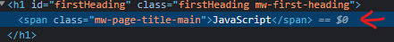

# Adding js to websites

1. [Inline script](#inline-script)
2. [Internal script](#internal-script)
3. [External script](#external-script)

## Inline script

We can run script on load page, but it's NOT good practice.

> RECOMMEND: NOT to use inline script on html

```html
<!DOCTYPE html>
<html lang="en">
  <head>
    <meta charset="UTF-8" />
    <meta name="viewport" content="width=device-width, initial-scale=1.0" />
    <title>Document</title>
  </head>
  <body onload="alert('Hello world!')">
    <h1>Hello World!</h1>
  </body>
</html>
```

## Internal script

Here we added `script` tag in html, interpreter reads `html` from top to bottom, when it hits `script` tag, it loads script before loading html `body`

```html
<!DOCTYPE html>
<html lang="en">
  <head>
    <meta charset="UTF-8" />
    <meta name="viewport" content="width=device-width, initial-scale=1.0" />
    <title>Document</title>
  </head>
  <body>
    <script>
      alert("Hello world!");
    </script>

    <h1>Hello World!</h1>
  </body>
</html>
```

## External script

It is recommended to add `script` at last **bottom** of line in html, inside `body` tag.

Try to experiment with `scritp` tag placing at top and middle in `html body`.

```html
<!DOCTYPE html>
<html lang="en">
  <head>
    <meta charset="UTF-8" />
    <meta name="viewport" content="width=device-width, initial-scale=1.0" />
    <title>Document</title>
  </head>
  <body>
    <h1>Hello World!</h1>
    <script src="index.js"></script>
  </body>
</html>
```

```js
// index.js

document.querySelector("h1").innerHTML = "Good bye!";
```

## Introduction to the Document Object Model (DOM)

```html
<!DOCTYPE html>
<html lang="en">
<head>
    <meta charset="UTF-8">
    <meta name="viewport" content="width=device-width, initial-scale=1.0">
    <title>Document</title>
</head>
<body>
    <h1>Hello</h1>
    <input type="checkbox" name="" id=""> <button>click me</button>
    <ul>
        <li>First</li>
        <li>Second</li>
        <li>Third</li>
    </ul>
</body>
</html>
```

HTML tree generator - tree visualizer


DOM - Document Object Model is ... search in google

Try below codes in console, each seperately

```js
document; // all html elements

document.firstElementChild; // html and all inside element

document.firstElementChild.firstElementChild; // only head element and it's inside element

document.firstElementChild.lastElementChild; // only body element will appear

document.firstElementChild.lastElementChild.firstElementChild; // h1

// now we save this element in variable

var heading = document.firstElementChild.lastElementChild.firstElementChild;

heading.innerHTML = "Good Bye!";

heading.style.color = "red";

// if you have input checkbox and it is unchecked then you can use below code to check

document.querySelector("input").click();
```

Let's say suppose `input` element how it checks with out clicking on that, by just writing one line of code.

Objects inside the DOM can have,

1. Properties - it describes the something about the object
2. Methods - it describes the object can do


Here we can get color of car like,

```js
car.color; //red
```

This is called `get property`.
---
To assign value
```js
car.numberOfDoors = 0; // assign 0 doors to the car
```
THis is called `set property`.
---
To drive a car or to take action on car
```js
car.drive();
```

> NOTE: To use all these functions and methods, we have to use `dot notation` ` . `  that should be an `Object`. means we can't use in `array`, it works only on `Objects`.


## Selecting HTML Elements with Javascript

1. document.getElementsByTagName
2. document.getElementsByClassName
3. document.getElementById
```js
document.getElementsByTagName("li"); 
/* list of li elements in array
["0": {},"1": {},"2": {}]
*/

document.getElementsByTagName("li").style.color = "purple";  // error because it's an array

document.getElementsByTagName("li")[2].styel.color = "purple"; // worked

document.getElementsByTagName("li").length; // 3
```

```js
 document.getElementsByClassName("btn"); // html collection

 document.getElementsByClassName("btn").styel.color = "red"; // error

 document.getElementsByClassName("btn")[0].styel.color = "red"; // worked
```


```js
document.getElementById("title");

document.getElementById("title").innerHTML = "Good Bye";


document.querySelector(); // select selector from css selector 

document.querySelector("h1"); // <h1>Hello</h1> 

document.querySelector("#title");  // <h1>Hello</h1> 

document.querySelector(".btn");

document.querySelector("li a"); // hierarchical selector query the selector where list has anchor tag 

document.querySelector("li.item"); 

document.querySelector("#list a");

document.querySelector("#list .item"); // gives only one li tag of first element 

document.querySelectorAll("#list .item"); 

document.querySelectorAll("#list .item")[2].styel.color = "red";

```
## Manipulating and Changing Styles of HTML Elements with Javascript

DOM object style property from w3schools

```js
document.querySelector("button").classList; // return all classes list which is using by button

document.querySelector("button").classList.add("invisible"); // add invisible class name in the button tag

document.querySelector("button").classList.remove("invisible"); //remove  invisible class name in the button tag

document.querySelector("button").classList.toggle("invisible"); // before this invisible tag is removed, so toggle add class in button and do vice versa. If it is true changed to false or if it is false then it changed to true 


```

## Text Manipulation and the Text Content Property

```HTML
<body>
    <h1>Hello</h1>
    <h2><strong>World!</strong></h2>
</body>  
```

```js
document.querySelector("h1").innerHTML; // Hello
document.querySelector("h2").innerHTML; // <strong>World!</strong>

document.querySelector("h1").textContent; // Hello
document.querySelector("h2").textContent; // World!

```

## Manipulating HTML Element Attributes

```html
<body>
    <h1>Hello</h1>
    <h2><strong>World!</strong></h2>
    <a href="www.google.com">Google</a>
</body>
```

```js
document.querySelector("a"); //  <a href="www.google.com">Google</a>

document.querySelector("a").attributes; // list all attributes of anchor tag

document.querySelector("a").getAttribute("href"); // www.google.com

document.querySelector("a").setAttribute("href","www.bing.com"); // setAttributes needs two parameters (attribute, value)

```


## Boss level Challenge 1 - The Dice game

[Download this source file](./assets/DOM/Dice%20challenge%201%20-%20completed/Dicee%20Challenge%20-%20Starting%20Files.zip)

Now make a working website [click here for completed site](./assets/DOM/Dice%20challenge%201%20-%20completed/dicee.html)

> NOTE: Site is woriking but the code is not readable, The code SHOULD BE in readable.

---
---
---

# Advanced Javascript and DOM Manipulation

1. [Event listener](#event-listeners)

[Download this source file](./assets/DOM/Drum%20challenge%202%20-%20completed/Drum%20Kit%20Starting%20Files.zip)

Now make a working website [click here for completed site](./assets/DOM/Drum%20challenge%202%20-%20completed/index.html)

## Event listeners

[MDN Event listener](https://developer.mozilla.org/en-US/docs/Web/API/EventTarget/addEventListener)

```js
addEventListener(type, listener);
```

1. [type event](https://developer.mozilla.org/en-US/docs/Web/Events#event_listing)
2. [listener](https://developer.mozilla.org/en-US/docs/Web/Events#event_listing)


```html
 <!-- 1. Add js source to html file -->
<script src="./index.js"></script>
```
```js
// 2. create a function handle click in js
function handleClick(){
  alert('I got clicked');
}

// 3. add eventlister
document.querySelector("button").addEventListener("click",handleClick); // here don't write handleClick() with parameters, otherwise it runs even not clicked. To avoid this we have to anonymous function. 

document.querySelector("button").addEventListener("click",handleClick()); // runs when page loads

document.querySelector("button").addEventListener("click",function(){  // cannot run until button is click
    handleClick(); 
});

// 4. We can also create a anonymous function and remove handleClick function
document.querySelector("button").addEventListener("click",function(){
  alert('I got clicked');
});
// but here We have to NOTE that only one button can function, another remaining button NOT at all work. So to do all buttons.

// 5. Add code in for loop and use querySelectorAll
var buttonList = document.querySelectorAll("button");
for(var i = 0;i<buttonList.length;i++){
    buttonList[i].addEventListener("click",function(){
        alert('I got clicked');
    })
}
```
## Higher Order Functions and Passing Functions as Arguments

You can change wikipedia title page of Javascript :funny:


Click inspect on Javascript title and in elements, you will see `$0` at end of the line.


Write code in console as shown below
```js
$0.innerHTML = "Salman"
```


```js
function add(num1, num2){
    return num1 + num2;
}
// add(2,3); // 5

function multiply(num1, num2){
    return num1 * num2;
}
// multiply(2,3); // 6


function calculator(num1, num2, operator){
    return operator(num1, num2); // operator => add or multiply which function name you are giving
}
// caluculator(2,3,add) // add(2,3) //5
```

### Debugger

```js
// write debugger; command before the function to debug that code. Here below is the code
function add(num1, num2){
    return num1 + num2;
}
// add(2,3); // 5

function multiply(num1, num2){
    return num1 * num2;
}
// multiply(2,3); // 6

debugger;
function calculator(num1, num2, operator){
    return operator(num1, num2); // operator => add or multiply which function name you are giving
}
// caluculator(2,3,add) // add(2,3) //5

```

> Higher Order Functions are functions that can take other functions as an input

### Exercise

change background image of a button

```css
.w{
background-image: url(./images/tom1.png);
}
```

## How to Play Sounds on a Website

```js
var audio = new Audio('audio_file.mp3');
audio.play();


var buttonList = document.querySelectorAll("button");
for(var i = 0;i<buttonList.length;i++){
    buttonList[i].addEventListener("click",function(){
        var audio = new Audio('./sounds/tom-2.mp3');
        audio.play();
    })
}
```


Here when we press every button the same sound is coming. To get the information of which button we press then we have to use `this` keyword

```js
var buttonList = document.querySelectorAll("button");
for(var i = 0;i<buttonList.length;i++){
    buttonList[i].addEventListener("click",function(){
      console.log(this);
    })
}

```
So let's break it down so we can understand what's going on.

So inside the loop the first thing that we do is we look through the document and we try to grab all of the elements that have a class of drum. So that basically gets us all of those buttons that have that class of drum.

Now the next thing we do is we loop through all of those elements starting from when `i` is equal to zero, and we add an event listener to it. And the next time we loop through, then the `i` becomes 1, and now we add the event listener to the second button.

So essentially our code will go through all of the buttons in turn, selecting them and adding the event listener, until we've gotten to the end of all of our buttons.

So now that all of our buttons have an event listener attached to it, what happens when we click on the first button? Then that button's event listener will trigger the function that was attached to the event listener.


### Exercise
Now change the color of text when we press button

```js
var buttonList = document.querySelectorAll("button");
for(var i = 0;i<buttonList.length;i++){
    buttonList[i].addEventListener("click",function(){
      this.style.color = "white";
    })
}
```

## A Deeper Understanding of Javascript Objects

There is a one Hotel in one city. One guest will come to that hotel. Now to carry thier bags and luggage, one bell boy need in that hotel. So we have created a bell boy in javascript called `Object`.

Object start with ` { ` open curly and close with ` } ` close curly brace. 
it's a `key : value` pair.

```js
var bellyBoly1 = {
  'name': 'Timmy',
  'age': 19,
  'work': ["lifting","takecare"]
}
```

Now let's say that our hotel has just been featured in the top hotels in the world and we're literally full every single day and we actually need far more bellboys than just the three that we've already got. And going through this process of every single time when we have to create a new object, we have to write the name property, name value, age property, age value, and actually, if you notice, for all of our bellboys, we have the same properties, and we don't actually have to type out all of these properties again and again and again every single time we want to construct a new bellboy object.
```js
var bellyBoly1 = {
  'name': 'Timmy1',
  'age': 19,
  'work': ["lifting","takecare"]
}
var bellyBoly2 = {
  'name': 'Timmy2',
  'age': 19,
  'work': ["lifting","takecare"]
}
var bellyBoly3 = {
  'name': 'Timmy3',
  'age': 20,
  'work': ["lifting","takecare"]
}
```
So what's the solution to this?
---
So we would create a function that has a name of BellBoy.
And this is called a `constructor function`. It's start `capital letter`

```js
function BellBoy(name, age, work){
  this.name = name;
  this.age = age;
  this.work = work;
}
```

To initialize the object we have to write this code,

```js
var bellBoy1 = new BellBoy("Timmy1", 19, "cleaning");
var bellBoy2 = new BellBoy("Timmy2", 20, "cleaning");
var bellBoy3 = new BellBoy("Timmy3", 19, "cleaning");
                      .
                      .
                      .

```

##  How to Use Switch Statements in Javascript

Now write switch statements in index.js code.

```js

var buttonList = document.querySelectorAll("button");
for(var i = 0;i<buttonList.length;i++){
    buttonList[i].addEventListener("click",function(){
        var buttonHtml = this.innerHTML;
        switch (buttonHtml) {
            case "w":
                var tom1 = new Audio('./sounds/tom-1.mp3');
                this.style.color = "white";
                tom1.play();
                break;
            case "a":
                var tom2 = new Audio('./sounds/tom-2.mp3');
                this.style.color = "white";
                tom2.play();
                break;
            case "s":
                var tom3 = new Audio('./sounds/tom-3.mp3');
                this.style.color = "white";
                tom3.play();
                break;
            case "d":
                var tom4 = new Audio('./sounds/tom-4.mp3');
                this.style.color = "white";
                tom4.play();
                break;

            case "j":
                var snare = new Audio('./sounds/snare.mp3');
                this.style.color = "white";
                snare.play();
                break;
            case "k":
                var crash = new Audio('./sounds/crash.mp3');
                this.style.color = "white";
                crash.play();
                break;
            case "l":
                var kick = new Audio('./sounds/kick-bass.mp3');
                this.style.color = "white";
                kick.play();
                break;
            default:
                break;
        }
        this.style.color = "red";
    })
}
```


## Objects, their Methods and the Dot Notation

Now what about methods? Let's say that our bellboy is able to do something called moveSsuitcase.
Now, I've kind of simplified it here, but it's effectively, he creates an alert saying "May I take your suitcase?", and then he picks up the suitcase and then he moves with the suitcase.

```js
function moveSuitCase() {
  alert('May I take your suitcase');
  pickUpSuitcase();
  move();
}
```

if we wanted our object to also have an associated function, then all we have to do is provide the name of the function as a new parameter, and then colon, and then after the colon we just put in the anonymous function.

```js
var bellBoy1 = {
  name : "Timmy",
  age : 19,
  work: "lifting",
  moveSuitcase: function (){
    alert('May I take your suitcase');
    pickUpSuitcase();
    move();
  }
}
```

And if we had a suitcase in the lobby then we can simply call the method and say bellBoy1.moveSuitcase(),

```js
bellBoy1.moveSuitcase();
```

If we want in a `constructor` method, then 

```js
function BellBoy(name, age, work){
  this.name = name;
  this.age = age;
  this.work = work;
  this.moveSuitcase: function (){
    alert('May I take your suitcase');
    pickUpSuitcase();
    move();
  }
}
```

Same as in Audio code, previously gone through this, if you look closely to that then,

```js
var tom1 = new Audio('./sounds/tom-1.mp3');
tom1.play();

// expanding this Audio contructor
function Audio (fileLocation){
  this.fileLocation = fileLocation;
  this.play = function(){
    // Tap into the audio hardware
    // Check the file at fileLocation exists
    // Check the file at fileLocation is a sound file
    // Play the file at fileLocation
  }
}
```

## Using Keyboard Event Listeners to Check for Key Press

`keypress` is now deprecated, instead of this we have to use `keydown` keyword.

```js
document.addEventListener("keydown", function(){
    alert('key is pressed');
})
```

For `keydown` key press an `event` is triggered.

```js
document.addEventListener("keydown", function(event){
    console.log(event);
})
```

So we want `key` value of that key pressed

```js
document.addEventListener("keydown", function(event){
    console.log(event.key);
})
```

```js
var buttonList = document.querySelectorAll("button");
for(var i = 0;i<buttonList.length;i++){
    buttonList[i].addEventListener("click",function(){
        var buttonHtml = this.innerHTML;
        makeSound(buttonHtml);
    });
}

document.addEventListener("keypress",function(event){
    makeSound(event.key);
})

function makeSound(keyPress){
        switch (keyPress) {
            case "w":
                var tom1 = new Audio('./sounds/tom-1.mp3');
                tom1.play();
                break;
            case "a":
                var tom2 = new Audio('./sounds/tom-2.mp3');
                tom2.play();
                break;
            case "s":
                var tom3 = new Audio('./sounds/tom-3.mp3');
                tom3.play();
                break;
            case "d":
                var tom4 = new Audio('./sounds/tom-4.mp3');
                tom4.play();
                break;

            case "j":
                var snare = new Audio('./sounds/snare.mp3');
                snare.play();
                break;
            case "k":
                var kick = new Audio('./sounds/kick-bass.mp3');
                kick.play();
                break;
            case "l":
                var crash = new Audio('./sounds/crash.mp3');
                crash.play();
                break;
            default:
                break;
        }
}
```

## Understanding Callbacks and How to Respond to Events

***pending***
