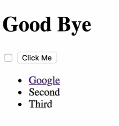
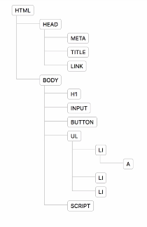
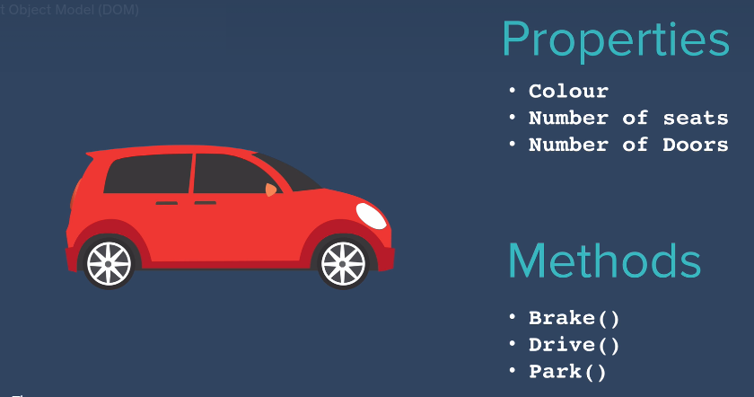

# Adding js to websites

1. [Inline script](#inline-script)
2. [Internal script](#internal-script)
3. [External script](#external-script)

## Inline script

We can run script on load page, but it's NOT good practice.

> RECOMMEND: NOT to use inline script on html

```html
<!DOCTYPE html>
<html lang="en">
  <head>
    <meta charset="UTF-8" />
    <meta name="viewport" content="width=device-width, initial-scale=1.0" />
    <title>Document</title>
  </head>
  <body onload="alert('Hello world!')">
    <h1>Hello World!</h1>
  </body>
</html>
```

## Internal script

Here we added `script` tag in html, interpreter reads `html` from top to bottom, when it hits `script` tag, it loads script before loading html `body`

```html
<!DOCTYPE html>
<html lang="en">
  <head>
    <meta charset="UTF-8" />
    <meta name="viewport" content="width=device-width, initial-scale=1.0" />
    <title>Document</title>
  </head>
  <body>
    <script>
      alert("Hello world!");
    </script>

    <h1>Hello World!</h1>
  </body>
</html>
```

## External script

It is recommended to add `script` at last **bottom** of line in html, inside `body` tag.

Try to experiment with `scritp` tag placing at top and middle in `html body`.

```html
<!DOCTYPE html>
<html lang="en">
  <head>
    <meta charset="UTF-8" />
    <meta name="viewport" content="width=device-width, initial-scale=1.0" />
    <title>Document</title>
  </head>
  <body>
    <h1>Hello World!</h1>
    <script src="index.js"></script>
  </body>
</html>
```

```js
// index.js

document.querySelector("h1").innerHTML = "Good bye!";
```

## Introduction to the Document Object Model (DOM)

```html
<!DOCTYPE html>
<html lang="en">
<head>
    <meta charset="UTF-8">
    <meta name="viewport" content="width=device-width, initial-scale=1.0">
    <title>Document</title>
</head>
<body>
    <h1>Hello</h1>
    <input type="checkbox" name="" id=""> <button>click me</button>
    <ul>
        <li>First</li>
        <li>Second</li>
        <li>Third</li>
    </ul>
</body>
</html>
```

HTML tree generator - tree visualizer




DOM - Document Object Model is ... search in google

Try below codes in console, each seperately

```js
document; // all html elements

document.firstElementChild; // html and all inside element

document.firstElementChild.firstElementChild; // only head element and it's inside element

document.firstElementChild.lastElementChild; // only body element will appear

document.firstElementChild.lastElementChild.firstElementChild; // h1

// now we save this element in variable

var heading = document.firstElementChild.lastElementChild.firstElementChild;

heading.innerHTML = "Good Bye!";

heading.style.color = "red";

// if you have input checkbox and it is unchecked then you can use below code to check

document.querySelector("input").click();
```

Let's say suppose `input` element how it checks with out clicking on that, by just writing one line of code.

Objects inside the DOM can have,

1. Properties - it describes the something about the object
2. Methods - it describes the object can do



Here we can get color of car like,

```js
car.color; //red
```

This is called `get property`.
---
To assign value
```js
car.numberOfDoors = 0; // assign 0 doors to the car
```
THis is called `set property`.
---
To drive a car or to take action on car
```js
car.drive();
```

> NOTE: To use all these functions and methods, we have to use `dot notation` ` . `  that should be an `Object`. means we can't use in `array`, it works only on `Objects`.


## Selecting HTML Elements with Javascript

1. document.getElementsByTagName
2. document.getElementsByClassName
3. document.getElementById
```js
document.getElementsByTagName("li"); 
/* list of li elements in array
["0": {},"1": {},"2": {}]
*/

document.getElementsByTagName("li").style.color = "purple";  // error because it's an array

document.getElementsByTagName("li")[2].styel.color = "purple"; // worked

document.getElementsByTagName("li").length; // 3
```

```js
 document.getElementsByClassName("btn"); // html collection

 document.getElementsByClassName("btn").styel.color = "red"; // error

 document.getElementsByClassName("btn")[0].styel.color = "red"; // worked
```


```js
document.getElementById("title");

document.getElementById("title").innerHTML = "Good Bye";


document.querySelector(); // select selector from css selector 

document.querySelector("h1"); // <h1>Hello</h1> 

document.querySelector("#title");  // <h1>Hello</h1> 

document.querySelector(".btn");

document.querySelector("li a"); // hierarchical selector query the selector where list has anchor tag 

document.querySelector("li.item"); 

document.querySelector("#list a");

document.querySelector("#list .item"); // gives only one li tag of first element 

document.querySelectorAll("#list .item"); 

document.querySelectorAll("#list .item")[2].styel.color = "red";

```
## Manipulating and Changing Styles of HTML Elements with Javascript

DOM object style property from w3schools

```js
document.querySelector("button").classList; // return all classes list which is using by button

document.querySelector("button").classList.add("invisible"); // add invisible class name in the button tag

document.querySelector("button").classList.remove("invisible"); //remove  invisible class name in the button tag

document.querySelector("button").classList.toggle("invisible"); // before this invisible tag is removed, so toggle add class in button and do vice versa. If it is true changed to false or if it is false then it changed to true 


```

## Text Manipulation and the Text Content Property

```HTML
<body>
    <h1>Hello</h1>
    <h2><strong>World!</strong></h2>
</body>  
```

```js
document.querySelector("h1").innerHTML; // Hello
document.querySelector("h2").innerHTML; // <strong>World!</strong>

document.querySelector("h1").textContent; // Hello
document.querySelector("h2").textContent; // World!

```

## Manipulating HTML Element Attributes

```html
<body>
    <h1>Hello</h1>
    <h2><strong>World!</strong></h2>
    <a href="www.google.com">Google</a>
</body>
```

```js
document.querySelector("a"); //  <a href="www.google.com">Google</a>

document.querySelector("a").attributes; // list all attributes of anchor tag

document.querySelector("a").getAttribute("href"); // www.google.com

document.querySelector("a").setAttribute("href","www.bing.com"); // setAttributes needs two parameters (attribute, value)

```


## Boss level Challenge 1 - The Dice game

[Download this source file](./assets/DOM/Dice%20challenge%201%20-%20completed/Dicee%20Challenge%20-%20Starting%20Files.zip)

Now make a working website [click here for completed site](./assets/DOM/Dice%20challenge%201%20-%20completed/dicee.html)

> NOTE: Site is woriking but the code is not readable, The code SHOULD BE in readable.

---
---
---

# Advanced Javascript and DOM Manipulation

1. [Event listener](#event-listeners)

[Download this source file](./assets/DOM/Drum%20challenge%202%20-%20completed/Drum%20Kit%20Starting%20Files.zip)

Now make a working website [click here for completed site](./assets/DOM/Drum%20challenge%202%20-%20completed/index.html)

## Event listeners

[MDN Event listener](https://developer.mozilla.org/en-US/docs/Web/API/EventTarget/addEventListener)

```js
addEventListener(type, listener);
```

1. [type event](https://developer.mozilla.org/en-US/docs/Web/Events#event_listing)
2. [listener]()


