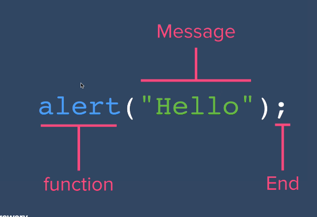

# JavaScript

## 1 Introduction to JS

- Netscape is the Dominent of browser in 1990's
- Mark Andreesen
- Mosoic
- windows 95

- Brendan Eich

1. LiveScript
2. JScript - Microsoft 
3. Javascript - ECMAScript (Europeon Computer Manufacturer Association)

What is Script?
Script is just a sequence of task to do.

```
Suppose: Actors
(After Gwyneth appears on stage for 1 second Brad appears.)
Gwyneth: "Hello."
    (Delay 1 sec)
Brad: "World!"
```

Java vs JavaScript [Youtube video](https://www.youtube.com/watch?v=_C5AHaS1mOA)
- Java and JavaScript are both different language.
- Imagine Car and Carpet. are Both same? NO, right! 
- So similarly both Java & JS are different in terms all factors

1. Java - compiled language, JS - interpreted language
2. Java- Fast running program, JS - Slow running program

## 2 Javascript Alerts

- Chrome -> Developer Tools -> Sources -> Snippets

- New snippets -> `alert("Hello world!");` -> Run (alt + Enter) 
- Same below line type -> `say("Hello world!");` -> Run (alt + Enter) ->  *Error* becoz `say()` is not a function

- Or **you can write in seperate documnet *html* file**

```html
<!DOCTYPE html>
<html lang="en">
<head>
    <meta charset="UTF-8">
    <meta name="viewport" content="width=device-width, initial-scale=1.0">
    <title>Document</title>
</head>
<body>
    <script>alert("Hello world!");</script>
</body>
</html>
```
[https://developer.mozilla.org/en-US/docs/Web/API/Window/alert](https://developer.mozilla.org/en-US/docs/Web/API/Window/alert)


> window.alert() instructs the browser to display a dialog with an optional message, and to wait until the user dismisses the dialog.



- You can use both single quote (`' '`) or double quore (`" "`) but most programmers PREFER `Double Quotes`.
 
