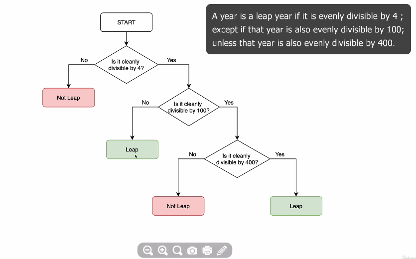
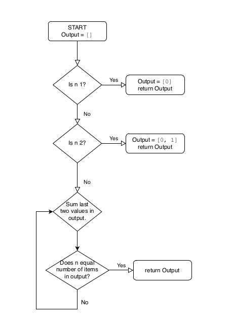

# Intermediate JavaScript

# Random Generator

`Math.random();` give a random decimal number length of `16` digit length size.

It generate from `0` to `0.9999999999999999`

> `var num = Math.random();` // 0.8933523638168663

```js
var number = Math.random();
console.log(number);
Math.floor(number * 6);
// Here numbers show only 0 to 5
```

## Exercise

Make a love percent generator (Just for Fun & Learn)

```js
var firstName = prompt("What's your firstName?");
var secondName = prompt("What's your secondName?");
var number = Math.random();
number = number * 100;
alert("Your love is " + Math.floor(number)) + "%";
```

# If else

```js
var firstName = prompt("What's your firstName?");
var secondName = prompt("What's your secondName?");
var number = Math.random();
number = number * 100;
if (number === 100) {
  // (number > 70)
  alert("Your love is " + Math.floor(number)) +
    "%, You both love each other like Kanye and Kanye!";
} else {
  alert("Your love is " + Math.floor(number)) + "%";
}
```

# Comparaters & Equality

`===` is `equal` to  
`!==` is `Not equal` to  
`>` is `greater` than  
`<` is `lesser` than  
`>=` is `greater or equal` to  
`<=` is `lesser or equal` to

```js
var a = 1;
var b = "1";

if (a === b) {
  console.log("Yes!");
} else {
  console.log("No!");
}
// No!

if (a == b) {
  console.log("Yes!");
} else {
  console.log("No!");
}
// Yes!
```

> Three equal sign `===` means, it check the Data Type and value. But where as two equal sign `==`, it only check the value and Do Not care about Data Type

- **Combiners**

1. `&&` AND
2. `||` OR
3. `!` NOT

### Exercise

BMI Calculator Advanced (IF/ELSE)
Previously, we've created a function that is able to calculate the BMI. But once we get a result, we will want to tell the user what the number means.

Write a function that outputs (returns) a different message depending on the BMI.

- BMI <18.5, the output should be: "Your BMI is <bmi>, so you are underweight."

- BMI 18.5-24.9, the output should be "Your BMI is <bmi>, so you have a normal weight."

- BMI >24.9, the output should be "Your BMI is <bmi>, so you are overweight."

The message MUST be returned as an output from your function. You should NOT NEED to use alert, prompt or console.log in this challenge.

IMPORTANT the message wording has to match precisely for the code to pass the validation. Including punctuation and capitalisation.

**SOLUTION**

```js
function bmiCalculator (weight, height) {
   var bmi = weight / Math.pow(height,2);
   var bmiRound = bmi.toFixed(2);
   if(bmiRound < 18.5){
       return "Your BMI is "+bmi+", so you are underweight.";
   } else if(bmiRound >= 18.5 && bmiRound <= 24.9){
       return "Your BMI is "+bmi+", so you have a normal weight.";
   } else r{
    eturn "Your BMI is "+bmi+", so you are overweight."
   }
}
```

### Leap Year challenge

You can check this link for more info on Leap Year

[https://www.mathsisfun.com/leap-years.html](https://www.mathsisfun.com/leap-years.html)



**SOLUTION**

```js
function leapYear(year) {
  if (year % 400 == 0 || (year % 4 == 0 && year % 100 != 0)) {
    return "Leap Year";
  } else {
    return "Not a Leap Year";
  }
}
leapYear(1600);
```

## Arrays

```js
var arrayList = ["Salman", "Sallu", "Khan", "Pathan"];

arrayList[0]; // "Salman"

arrayList.length(); // 4

arrayList.includes("Salman"); // true
```

## Adding Elements and Intermediate Array Techniques

```js
var output = [];

output.push(1);
// 1
output.push(2);
// [1, 2]

output.pop(); // removes last element from the element
// [1]
```

### Exercise

```js
var output = [];
var count = 1;

function fizzBuzz() {
  if (count % 5 == 0 && count % 3 == 0) {
    output.push(" FizzBuzz");
    count++;
  } else if (count % 5 == 0) {
    output.push("Buzz");
    count++;
  } else if (count % 3 == 0) {
    output.push("Fizz");
    count++;
  } else {
    output.push(count);
    count++;
  }

  console.log(output);
}
```

### Exercise

Who's Buying Lunch? Code Challenge
You are going to write a function which will select a random name from a list of names. The person selected will have to pay for everybody's food bill.

Important: The output should e returned from the function and you do not need alert, prompt or console.log. The output should match the example output exactly, including capitalisation and punctuation.

Example Input

["Angela", "Ben", "Jenny", "Michael", "Chloe"]
Example Output

Michael is going to buy lunch today!

Hint

1. You might need to think about Array.length.

2. Remember that Arrays start at position 0!

**SOLUTION**

```js
function whosPaying(names) {
  /******Don't change the code above*******/

  //Write your code here.
  var num = Math.floor(Math.random() * names.length);
  return names[num] + " is going to buy lunch today!";

  /******Don't change the code below*******/
}

whosPaying(["Angela", "Salman", "Sallu", "Khan", "Pathan"]);
```

# Control Statements

## While loop

```js
while(something is true){
    // do something
}
```

Example

```js
var output = [];
var count = 1;

function fizzBuzz() {
  while (count <= 100) {
    if (count % 5 == 0 && count % 3 == 0) {
      output.push(" FizzBuzz");
    } else if (count % 5 == 0) {
      output.push("Buzz");
    } else if (count % 3 == 0) {
      output.push("Fizz");
    } else {
      output.push(count);
    }
    count++;
  }
  console.log(output);
}
```

### Exercise
```js
var numberOfBottles = 99
while (numberOfBottles >= 0) {
    var bottleWord = "bottle";
    if (numberOfBottles === 1) {
        bottleWord = "bottles";
    } 
    console.log(numberOfBottles + " " + bottleWord + " of beer on the wall");
    console.log(numberOfBottles + " " + bottleWord + " of beer,");
    console.log("Take one down, pass it around,");
	numberOfBottles--;
    console.log(numberOfBottles + " " + bottleWord + " of beer on the wall.");
}
```


## for Loop
```js
    //start   end    change
for (  i=0  ; i<2  ;   i++  ){
  //do something
}
```
```js
var output = [];
var count = 1;

function fizzBuzz() {
  for (var count = 1; count <= 100; count++) {
    if (count % 5 == 0 && count % 3 == 0) {
      output.push(" FizzBuzz");
    } else if (count % 5 == 0) {
      output.push("Buzz");
    } else if (count % 3 == 0) {
      output.push("Fizz");
    } else {
      output.push(count);
    }
  }
  console.log(output);
}
```

> While is used in state condition and for loop is used in iterate condition

## Introducing the Fibonacci Code Challenge



```js
function fibo(last){
   var array = [];
   if(last == 1){
         array = [0];
      }else if(last == 2){
        array = [0,1];
      } else{
         array = [0,1];
         for(var i = 2;i<last;i++){
            array.push(array[array.length-2]+array[array.length-1]);
      }
   }
   return array;
}

```

