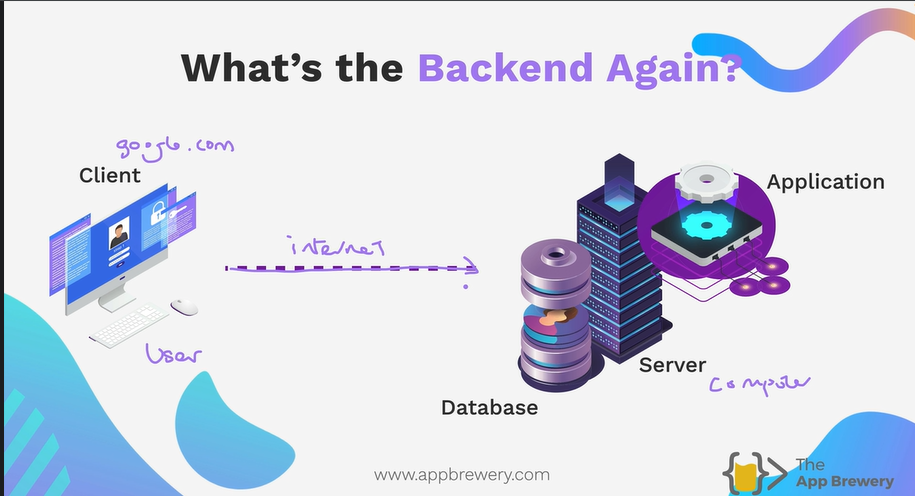

# Express

What is Express?
It's a Javascript Framework, where as node is JS runtime environment.

It's like JavaScript is nail, to use or put in a wall we use Screwdriver. So Express work like as a Screw Drill Driver.
Works easy and handy and fast.





## Creating Our First Server with Express
1. Create directory
2. Create index.js file
3. Initialise NPM
4. Install the Express package
5. Write Server application in index.js
6. Start server

[https://expressjs.com/en/starter/installing.html](https://expressjs.com/en/starter/installing.html)

```bash
$ mkdir myapp
$ cd myapp
$ npm init

# entry point: (index.js)

$ npm i express
# $  npm install express

# To install Express temporarily and not add it to the dependencies list:
$ npm install express --no-save
```

NOTE: in `package.json`  write `"type" : "module"` for `ESM`

Write this below code in `index.js`

```js
import express from "express";
const app = express();

app.listen(3000, () => {
    console.log("Server running on port 3000");
});
```

To run a node.js program

`node index.js`

You will get `Cannot GET /`

List of port used by OS 


Search `keynote` on google


## HTTP Request

HTTP is stand for `HyperText Transport protocol`

Request Vocab

1. GET     --> Request resource
2. POST    --> Sending resource
3. PUT     --> Replace resource or update 
4. PATCH   --> Patch up a resource (both are update meaning but works are different.)
5. DELETE  --> Delete resource from the server or database

```js
import express from "express";
const app = express();

app.get("/", (req, res) => {
    console.log(req.rawHeaders);
    res.send("Hello, World!");
});

app.listen(3000, () => {
    console.log("Server running on port 3000");
});
```

Here `app.get("/")` means, when a user access `GET` request with ` / ` home address then send the response to the user of `"Hello, World!"`

Suppose in our example we are using `localhost:3000/`, this ` / ` means the home address of local host


> nodemon is a tool which is similar to live server

```bash
$ npm i -g nodemon
```
`-g` means `globally` 

use `nodemon index.js`  instead of `node index.js`


```js
import express from "express";
const app = express();

app.get("/", (req, res) => {
    res.send("<h1>Home Page</h1>");
});

app.get("/about", (req, res) => {
    res.send("<h1>About Me</h1>");
});

app.listen(3000, () => {
    console.log("Server running on port 3000");
});
```

### Exercise


## Postman

HTTP responses


[https://developer.mozilla.org/en-US/docs/Web/HTTP](https://developer.mozilla.org/en-US/docs/Web/HTTP)


### Exercise

```js
import express from "express";
const app = express();
const port = 3000;

// *********************
// Let’s practice using Postman. Make sure your server is running with nodemon.
// Then test the 5 different routes below with Postman. Open a separate tab for each request.
// Check that for each route you’re getting the correct status code returned to you from your server.
// You should not get any 404s or 500 status codes.
// *********************

app.get("/", (req, res) => {
  res.send("<h1>Home Page</h1>");
});

app.post("/register", (req, res) => {
  //Do something with the data
  res.sendStatus(201);
});

app.put("/user/angela", (req, res) => {
  res.sendStatus(200);
});

app.patch("/user/angela", (req, res) => {
  res.sendStatus(200);
});

app.delete("/user/angela", (req, res) => {
  //Deleting
  res.sendStatus(200);
});

app.listen(port, () => {
  console.log(`Server started on port ${port}`);
});
```

# Introduction to Middlewares

Google search what is middle ware is nodejs or expressjs

```html
<form action="/login" method="POST">
  <label for="email">Email</label><br>
  <input type="text" id="fname" name="email" required><br>
  <label for="password">Password</label><br>
  <input type="text" name="password" value="Doe"><br><br>
  <input type="submit" value="Submit">
</form> 
```

The above code is used as Sign in Form in html

```
/Folder
│   index1.js
│   index2.js
│   index3.js
│   index4.js
│   package-lock.json
│   package.json
│   solution1.js
│   solution2.js
│   solution3.js
│   solution4.js
│
└───public
        index.html
```

Here in `public` folder is available, where `index.html` and other static files could be there like `style.css`, `images.png` and other things that are not going to change.

```js
import express from "express";
import { dirname } from "path";
import { fileURLToPath } from "url";
const __dirname = dirname(fileURLToPath(import.meta.url));

const app = express();
const port = 3000;

app.get("/", (req, res) => {
  res.sendFile(__dirname + "/public/index.html");
});

app.listen(port, () => {
  console.log(`Listening on port ${port}`);
});

```
[res.sendFile link](https://expressjs.com/en/4x/api.html#res.sendFile)

`__dirname` returns the file path.


We use `body parser` package in node js for **Middle ware** in expressjs


